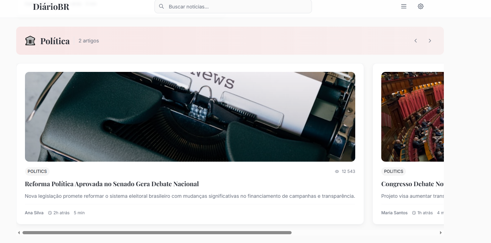
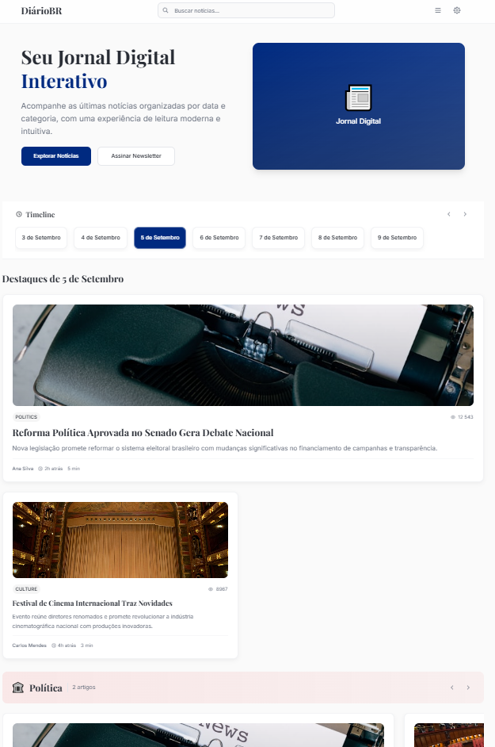

# DiárioBR - Jornal Digital Interativo

Um jornal digital moderno e interativo construído com Vue 3, TypeScript e Tailwind CSS, baseado no design do Figma.

> 📋 **Design Original**: [Visualizar no Figma](https://www.figma.com/design/plYpoHTWoMAxhAHMn5lRPg/jornal-template?node-id=1-1267&t=xKXHWVubotBkjVtr-4) - Compare com as imagens anexadas para verificar a fidelidade da implementação.

## 📸 Comparação Visual

### Design Original (Figma)

*Página principal com seção hero, timeline e destaques*


*Seção de artigos por categoria (Política)*

### Implementação Atual

*Implementação da página principal*

> 💡 **Nota**: Para adicionar as imagens reais, salve os screenshots da implementação atual na pasta `images/` com os nomes especificados acima.

## 🚀 Características

- **Design Responsivo**: Interface moderna e adaptável para diferentes dispositivos
- **Tipografia Elegante**: Uso das fontes Playfair Display e Inter conforme o design
- **Cores Personalizadas**: Paleta de cores baseada no design original
- **Componentes Modulares**: Arquitetura componentizada para fácil manutenção
- **TypeScript**: Tipagem estática para maior segurança e produtividade
- **Tailwind CSS**: Estilização utilitária e customizada

## 🎨 Design System

### Cores
- **Primary Blue**: `#002a80` - Cor principal do jornal
- **Text Primary**: `#282c34` - Cor principal do texto
- **Text Secondary**: `#6b7280` - Cor secundária do texto
- **Background**: `#ffffff` e `#fafafa` - Cores de fundo

### Tipografia
- **Títulos**: Playfair Display (Bold, SemiBold)
- **Corpo**: Inter (Regular, Medium)

### Categorias
- **Política**: Gradiente vermelho (`#ef44441a` → `#dc26260d`)
- **Cultura**: Gradiente roxo (`#a855f71a` → `#9333ea0d`)
- **Esportes**: Gradiente verde (`#22c55e1a` → `#16a34a0d`)
- **Tecnologia**: Gradiente azul (`#3b82f61a` → `#2563eb0d`)

## 🛠️ Instalação

1. **Clone o repositório**:
```bash
git clone <url-do-repositorio>
cd jornal-digital-vue
```

2. **Instale as dependências**:
```bash
npm install
```

3. **Execute o projeto em modo de desenvolvimento**:
```bash
npm run dev
```

4. **Acesse no navegador**:
```
http://localhost:3000
```

## 📦 Scripts Disponíveis

- `npm run dev` - Executa o projeto em modo de desenvolvimento
- `npm run build` - Gera a versão de produção
- `npm run preview` - Visualiza a versão de produção
- `npm run type-check` - Verifica os tipos TypeScript

## 🏗️ Estrutura do Projeto

```
src/
├── components/          # Componentes Vue
│   ├── AppHeader.vue   # Cabeçalho da aplicação
│   ├── AppFooter.vue   # Rodapé da aplicação
│   ├── HeroSection.vue # Seção hero principal
│   ├── TimelineSection.vue # Seção de timeline
│   ├── FeaturedSection.vue # Seção de destaques
│   ├── CategorySection.vue # Seção de categorias
│   └── NewsCard.vue    # Card de notícia
├── types/              # Definições TypeScript
│   └── index.ts        # Interfaces e tipos
├── App.vue             # Componente principal
├── main.ts             # Ponto de entrada da aplicação
└── style.css           # Estilos globais e Tailwind
```

## 🎯 Funcionalidades Implementadas

- ✅ Header com logo, busca e navegação
- ✅ Seção hero com call-to-action
- ✅ Timeline interativa com navegação por datas
- ✅ Seção de destaques com artigo principal
- ✅ Seções por categoria (Política, Cultura, Esportes, Tecnologia)
- ✅ Cards de notícias responsivos
- ✅ Footer informativo
- ✅ Design system completo baseado no Figma

## 🔧 Tecnologias Utilizadas

- **Vue 3** - Framework JavaScript progressivo
- **TypeScript** - Superset tipado do JavaScript
- **Tailwind CSS** - Framework CSS utilitário
- **Vite** - Build tool moderno e rápido
- **PostCSS** - Processador CSS
- **Autoprefixer** - Adiciona prefixos CSS automaticamente

## 📱 Responsividade

O projeto foi desenvolvido com foco na responsividade, utilizando:
- Grid system flexível
- Breakpoints do Tailwind CSS
- Componentes adaptáveis
- Imagens responsivas

## 🎨 Customização

Para customizar o design, edite os arquivos:
- `tailwind.config.js` - Configurações do Tailwind
- `src/style.css` - Estilos globais e componentes
- `src/types/index.ts` - Tipos e interfaces

## 📄 Licença

Este projeto é open source e está disponível sob a licença MIT.
